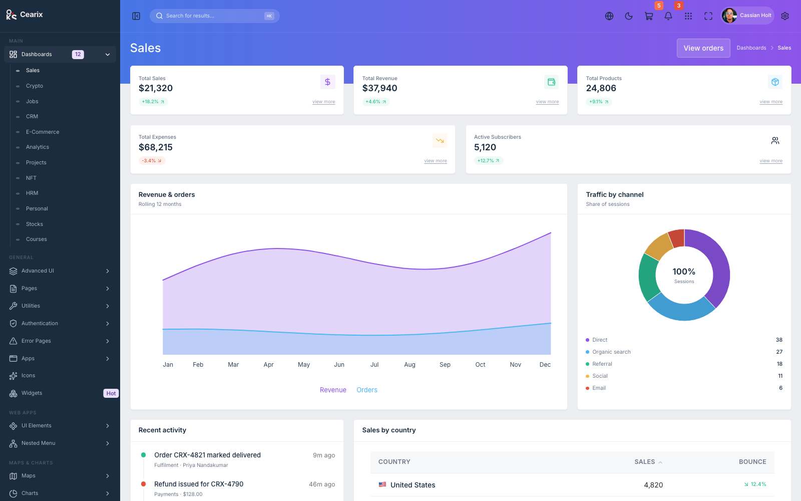
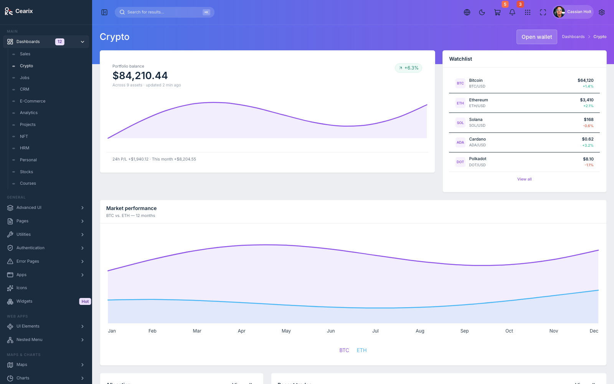
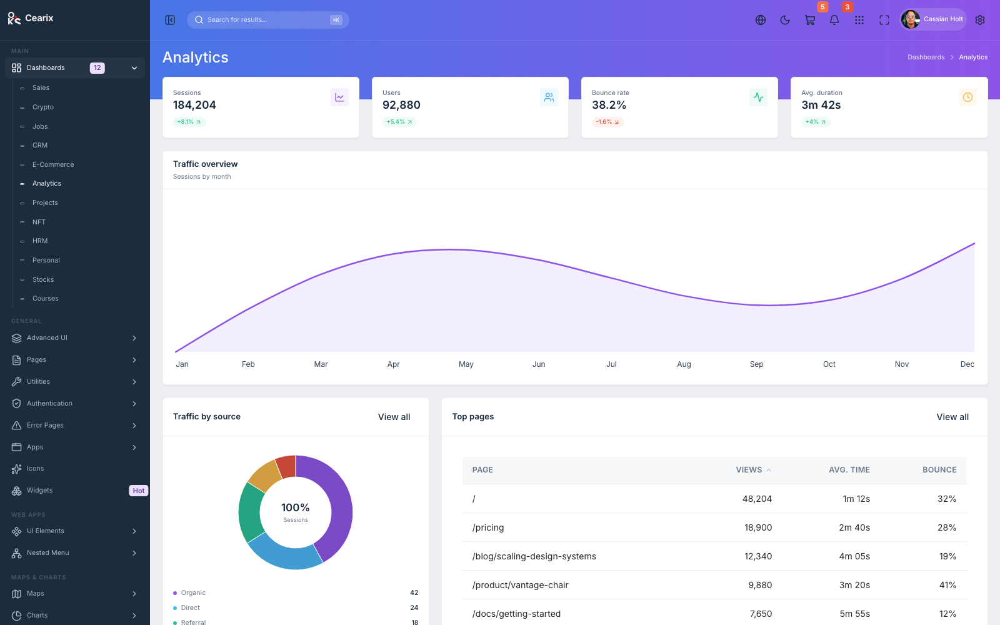
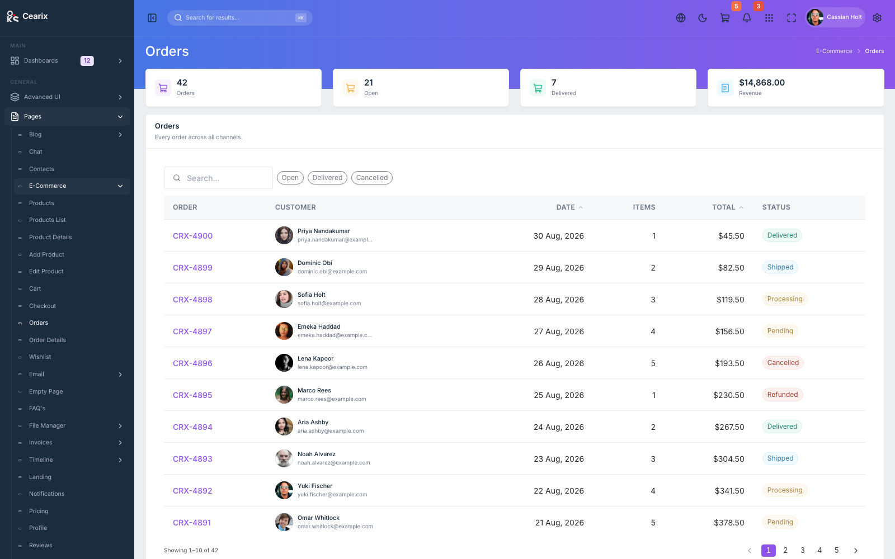
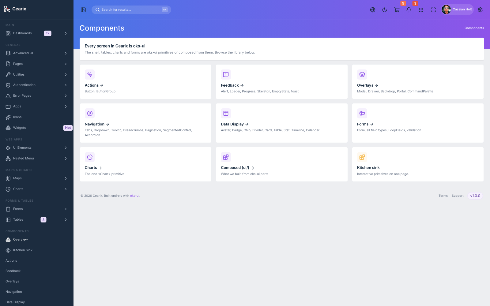

# Cearix

An admin dashboard template built entirely with [oks-ui](https://www.oks-ui.com/docs/).

Every visible element — the shell, tables, charts, forms, menus — is an oks-ui
primitive or composed from oks-ui primitives. No other UI, charting, form, or
data-fetching library.

- **Live demo:** https://oks-projects.github.io/cearix/
- **Repository:** https://github.com/OKS-PROJECTS/cearix



## Stack

- Vite + React 19 (JavaScript)
- `react-router-dom` v7
- Tailwind v4 — layout utilities only; every colour, radius, border and shadow
  is a CSS variable
- oks-ui `^1.3.2`
- `lucide-react` for icons

## Scripts

```bash
npm install
npm run dev      # start the dev server
npm run lint     # oxlint — must be clean
npm run build    # production build
npm run preview  # preview the build
```

## Screenshots

| Crypto dashboard | Analytics dashboard |
| --- | --- |
|  |  |

| Orders list | Component gallery |
| --- | --- |
|  |  |

## How the `ui/` layer works

`src/Components/ui/` holds components composed from oks-ui primitives that oks-ui
does not ship as-is — `Surface`, `PageHeader`, `KpiCard`, `DataTable`,
`DonutCard`, `ChartCard` and more. Application screens are config-driven
archetypes (`ListPage`, `FormPage`, `DetailPage`, `SettingsPage`,
`DashboardPage`) fed by objects in `src/data/`. All data is deterministic mock
data — there is no backend.

See [`CHANGELOG.md`](./CHANGELOG.md) for release notes and the compatible oks-ui
range.

## License

MIT © OKS-PROJECTS
